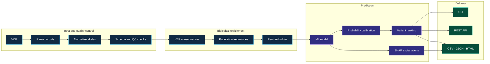
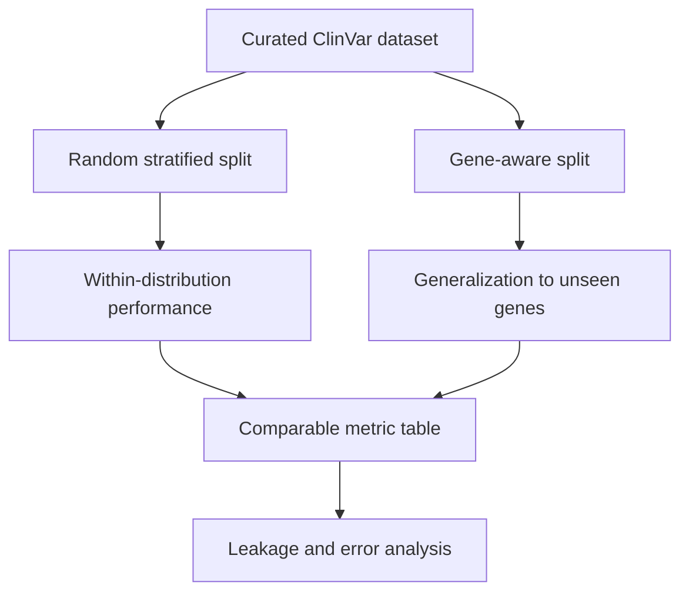

<p align="center">
  
</p>

<h1 align="center">VariantRank</h1>

<p align="center">
  <strong>From raw VCF records to reproducible, explainable variant prioritization.</strong>
</p>

<p align="center">
  <a href="https://github.com/ArtemFiend/variant-rank/actions/workflows/ci.yml"></a>
  <a href="https://www.python.org/"></a>
  <a href="Dockerfile"></a>
  <a href="LICENSE"></a>
</p>

<p align="center">
  <a href="#overview">Overview</a> ·
  <a href="#architecture">Architecture</a> ·
  <a href="#quick-start">Quick start</a> ·
  <a href="#examples">Examples</a> ·
  <a href="#validation-strategy">Validation</a> ·
  <a href="#development">Development</a>
</p>

## Overview

VariantRank is an end-to-end bioinformatics and machine-learning system for
prioritizing genetic variants by their probability of clinical significance.
It connects genomic input processing, functional and population annotations,
feature engineering, calibrated prediction, ranking, explainability, and
delivery through a command-line interface and REST API.

The project treats validation as part of the biological problem. Alongside a
random stratified baseline, it uses gene-aware evaluation to measure how well a
model generalizes to genes it did not see during training.

### What the system is built to provide

| Area | Capability |
|---|---|
| Genomics | VCF parsing, multiallelic decomposition, canonical coordinates, SNV/indel normalization |
| Annotation | Ensembl VEP consequences, transcript metadata, population frequencies |
| Machine learning | Logistic Regression, Random Forest, CatBoost, LightGBM, calibrated probabilities |
| Validation | Random and gene-aware splits, leakage audit, classification and ranking metrics |
| Explainability | Global feature importance and per-variant SHAP explanations |
| Delivery | Versioned artifacts, CLI, REST API, CSV/JSON/HTML reports, Docker |
| Reproducibility | Locked dependencies, YAML configuration, dataset checksums, tests and CI |

## Architecture



Training and inference share the same normalization and feature contracts. A
saved model artifact carries its feature schema, categorical columns,
calibrator, decision threshold, metrics, model version, and dataset metadata.

## Quick start

VariantRank requires Python 3.12+ and
[`uv`](https://docs.astral.sh/uv/getting-started/installation/).

```bash
git clone https://github.com/ArtemFiend/variant-rank.git
cd variant-rank
uv sync --all-extras
uv run variantrank --help
```

Validate a VCF before annotation or inference:

```bash
uv run variantrank validate-vcf tests/fixtures/example.vcf
```

```text
Valid VCF: 2 records, 3 alleles
Chromosomes: 13, 17
```

Build reproducible GRCh38 training labels from the current ClinVar release:

```bash
uv run variantrank prepare-data
```

The command verifies the NCBI checksum and writes Dataset A, the high-confidence
Dataset B, QC counters, and source provenance to `data/processed/`. The complete
curation policy is documented in the
[ClinVar training data contract](docs/data-contract.md).

The verified 2026-09-08 snapshot produced 1,633,976 unique GRCh38 SNV/indel
labels in Dataset A and 373,073 high-confidence labels in Dataset B. See the
[dataset build summary](reports/tables/clinvar_dataset_summary.md) for checksums,
class distributions, and filtering counts.

Train the first leakage-safe baselines under random and gene-aware validation:

```bash
uv run variantrank train --strategy both
```

For a fast development run, add `--max-rows 100000`. The persisted artifact
contains the fitted pipeline, feature schema, dataset checksum, split statistics,
training duration, and validation/test metrics.

### First reproducible baseline

The initial annotation-free Logistic Regression uses only normalized allele
properties—no gene identity, ClinVar assertions, or external pathogenicity
scores. Results are held-out test metrics from the verified ClinVar snapshot.

| Dataset | Split | ROC-AUC | PR-AUC | MCC | F1 |
|---|---|---:|---:|---:|---:|
| A | Random | 0.7522 | 0.5342 | 0.3484 | 0.4796 |
| A | Gene-aware | 0.7507 | 0.5352 | 0.3515 | 0.4813 |
| B, high confidence | Random | 0.7203 | 0.5420 | 0.3005 | 0.4717 |
| B, high confidence | Gene-aware | 0.7005 | 0.5295 | 0.2861 | 0.4547 |

These measurements establish the lower bound for subsequent annotated models;
they are not presented as calibrated clinical probabilities. The
[complete baseline report](reports/tables/baseline_results.md) includes the
dummy baseline, all classification and probability metrics, split sizes, and
interpretation.

Start the API locally:

```bash
uv run uvicorn variantrank.api.app:app --host 0.0.0.0 --port 8000
```

Open the interactive OpenAPI documentation at
[`http://localhost:8000/docs`](http://localhost:8000/docs).

### Docker

```bash
docker compose up --build
curl http://localhost:8000/health
```

```json
{"status":"ok"}
```

## Examples

### Input VCF

VariantRank accepts standard VCF records and emits one internal variant per ALT
allele. The example below therefore contains two records and three alleles.

```vcf
##fileformat=VCFv4.2
##reference=GRCh38
#CHROM  POS       ID           REF  ALT  QUAL  FILTER  INFO
chr17   7674220   rs121912651  C    T    .     PASS    .
chr13   32340301  .            C    T,G  .     PASS    .
```

Canonical variant keys use the form `chrom:pos:ref:alt`:

```text
17:7674220:C:T
13:32340301:C:T
13:32340301:C:G
```

### Ranked output contract

The inference pipeline produces a stable tabular contract suitable for reports,
downstream review, and API responses. This example illustrates the final schema;
scores are demonstrative rather than benchmark results.

| Rank | Variant | Gene | Consequence | Population AF | Score | Prediction |
|---:|---|---|---|---:|---:|---|
| 1 | `17:7674220:C:T` | TP53 | missense_variant | 0.00001 | 0.947 | Pathogenic |
| 2 | `13:32340301:C:T` | BRCA2 | stop_gained | 0.00003 | 0.916 | Pathogenic |
| 3 | `2:215632123:G:A` | BARD1 | missense_variant | 0.00210 | 0.731 | Uncertain |

Machine-readable output follows the same contract:

```json
{
  "model_version": "1.0.0",
  "variants": [
    {
      "rank": 1,
      "variant": "17:7674220:C:T",
      "gene": "TP53",
      "consequence": "missense_variant",
      "score": 0.947,
      "prediction": "pathogenic"
    }
  ]
}
```

## Validation strategy

Random variant-level splits can place closely related variants from the same
gene in both training and test sets. VariantRank measures that optimism directly
by evaluating every candidate model under two complementary protocols.



Primary classification metrics are ROC-AUC, PR-AUC, MCC, precision, recall, and
F1. Probability quality is measured with Brier score, log loss, and calibration
curves. Variant prioritization is assessed with Precision@K, Recall@K, MRR, and
NDCG@K on simulated patient-like variant sets.

No ClinVar assertion or direct derivative of the target label is admitted as a
feature. External pathogenicity scores are isolated in a separate feature set
because some may have been trained on ClinVar-derived labels.

## Configuration and artifacts

Pipeline behavior is controlled through versioned YAML files in
[`configs/`](configs/):

```yaml
random_seed: 42

validation:
  strategy: gene_group
  folds: 5

model:
  type: catboost
  iterations: 1000
  depth: 7
  learning_rate: 0.05
```

A released model directory is self-describing:

```text
artifacts/models/v1/
├── model.cbm
├── calibrator.joblib
├── feature_schema.json
├── metadata.json
├── metrics.json
└── threshold.json
```

Dataset provenance records the source URL, source release, download timestamp,
raw-file checksum, genome assembly, feature schema, random seed, package
versions, model version, and Git commit.

## Project structure

```text
variant-rank/
├── configs/                 Pipeline and experiment configuration
├── data/                    Raw, interim, processed, and external data
├── artifacts/               Versioned models, metrics, and encoders
├── reports/                 Figures, tables, and example reports
├── src/variantrank/
│   ├── api/                 FastAPI application and schemas
│   ├── data/                VCF and dataset ingestion
│   ├── domain/              Core genomic domain objects
│   └── cli.py               Command-line interface
├── tests/                   Unit, integration, API, and fixtures
├── Dockerfile
├── docker-compose.yml
├── Makefile
├── pyproject.toml
└── uv.lock
```

## Implementation status

| Component | State |
|---|---|
| Installable package and locked environment | Available |
| VCF parsing, multiallelic decomposition and validation | Available |
| Canonical chromosome naming and minimal allele representation | Available |
| CLI and service health endpoints | Available |
| Unit and API test suite | Available |
| Docker image and GitHub Actions workflows | Available |
| ClinVar curation and versioned Parquet dataset | In progress |
| VEP and population annotation | Scheduled |
| Model comparison and gene-aware validation | Scheduled |
| Calibration, SHAP, ranked inference and reports | Scheduled |

The full engineering and scientific scope is documented in
[`VariantRank_TZ.md`](VariantRank_TZ.md).

## Development

The standard local quality gate mirrors CI:

```bash
make install
make check
```

Individual commands are available when iterating on one layer:

```bash
make format
make lint
make typecheck
make test
make docker
```

The current suite covers VCF parsing, multiallelic records, normalization,
domain validation, CLI behavior, and API responses.

## Responsible use

VariantRank is intended for bioinformatics research and software evaluation.
Its output requires independent review and must not be used as the sole basis
for diagnosis, treatment, or other clinical decisions. The system does not
implement clinical-grade ACMG/AMP classification and has not undergone clinical
validation.

Known sources of uncertainty include ClinVar ascertainment bias, class
imbalance, conflicting interpretations, incomplete annotations, gene-level
distribution shift, and overlap between public pathogenicity predictors and
previously labeled variants.

## License

VariantRank is available under the [MIT License](LICENSE).
