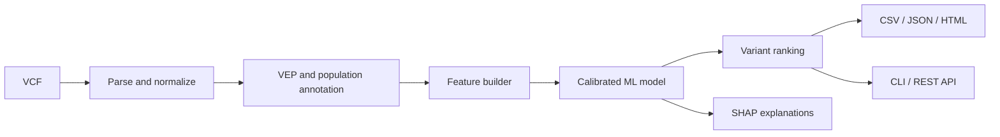

# VariantRank

> End-to-end machine-learning system for prioritizing potentially pathogenic
> genetic variants from VCF files with robust, gene-aware validation.

[](https://github.com/ArtemFiend/variant-rank/actions/workflows/ci.yml)
[](https://www.python.org/)
[](LICENSE)

> [!WARNING]
> VariantRank is a research and educational project. It is not intended for
> diagnosis, treatment decisions, or other clinical use.

## Why VariantRank?

VariantRank is designed as a reproducible bioinformatics and machine-learning
system rather than a notebook-only experiment. It will turn VCF records into
ranked, explainable pathogenicity estimates while explicitly testing how much
random validation overstates performance compared with gene-aware validation.

## Architecture



## Current status

The repository is at **v0.1 development stage**. The initial runnable slice
includes:

- an installable Python package;
- lightweight VCF parsing and validation;
- canonical chromosome names and minimal REF/ALT representation;
- a Typer CLI;
- FastAPI health and model-information endpoints;
- unit and API tests;
- linting, type checking, CI, and a production image.

ClinVar ingestion, VEP integration, model training, calibration, SHAP, and
ranked inference are tracked next milestones. See the complete
[technical specification](VariantRank_TZ.md).

## Quick start

Prerequisites: Python 3.12+ and [`uv`](https://docs.astral.sh/uv/).

```bash
uv sync --all-extras
uv run variantrank --help
uv run variantrank validate-vcf tests/fixtures/example.vcf
```

Start the API:

```bash
uv run uvicorn variantrank.api.app:app --reload
```

Then open `http://127.0.0.1:8000/docs` or check:

```bash
curl http://127.0.0.1:8000/health
curl http://127.0.0.1:8000/model/info
```

## Development

```bash
make install
make check
make test
```

## Planned validation

Model evaluation will compare random stratified splits with gene-aware splits
using ROC-AUC, PR-AUC, MCC, calibration metrics, and ranking metrics. Features
derived directly from ClinVar labels will be prohibited, and pathogenicity
predictors with possible ClinVar training overlap will be evaluated separately.

## Repository layout

```text
configs/                 Reproducible pipeline configuration
src/variantrank/         Application package
tests/                   Unit, integration, and API tests
data/                    Local data lifecycle (large files ignored)
artifacts/               Models, schemas, and metrics (ignored)
reports/                 Figures, tables, and examples
```

## Limitations

The planned model will inherit limitations from ClinVar ascertainment bias,
class imbalance, conflicting interpretations, incomplete annotations, and
gene-level distribution shift. It will not implement clinical-grade ACMG/AMP
classification and will not be clinically validated.

## License

Licensed under the [MIT License](LICENSE).
